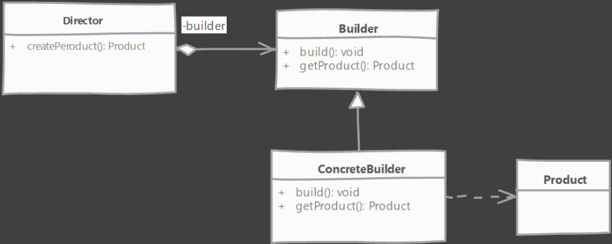

# Builder-design-pattern

- Useful when we have a class with a complex constructor.

Or 

- For creating an object of that class we would need to create other objects needed by the final object ( Class that has custom objects as variables ).

## Architectural diagram

### Sometimes we skip the builder, and create a concrete builder as a subclass inside the product class.